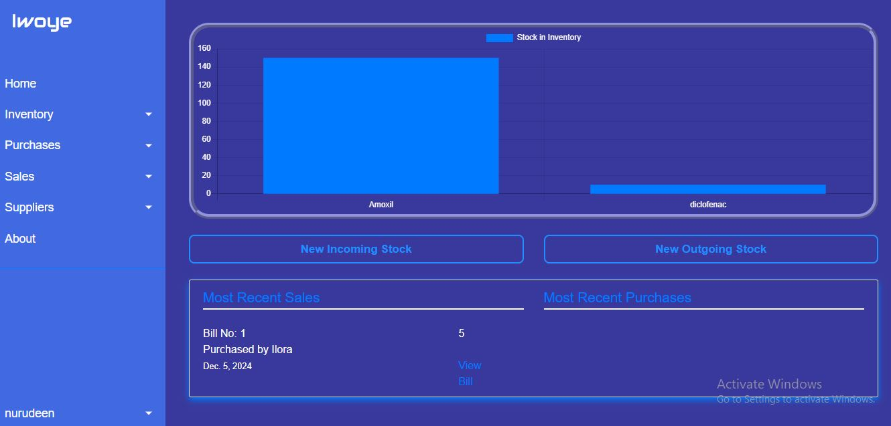

# What is 'Iwoye'?
Iwoye is a simple inventory management software built with Django.
Users can add stock item and generate bills. All data is stored in database and are rendered in real time

# Setup Instructions
No: The project is currently for a single company and hence you cannot login online. To run this project locally, follow these steps:

1. **Clone the repository:**
   ```bash
   git clone https://github.com/NdAbdulsalaam/Iwoye.git
   cd Iwoye
   ```

2. **Create a virtual environment:**
   ```bash
   pipenv shell
   ```

3. **Install dependencies:**
   ```bash
   pipenv install
   ```

4. **Apply first database migrations:**
   ```bash
   py manage.py makemigrations homepage
   py manage.py migrate homepage
   py manage.py makemigrations inventory
   py manage.py migrate inventory
   py manage.py makemigrations transactions
   py manage.py migrate transactions
   ```
After the first time, the following can be run to migrate model changes in any app
   ```bash
   py manage.py makemigrations
   py manage.py migrate
   ```

5. **Create a superuser (admin):**
   ```bash
   py manage.py createsuperuser
   ```

6. **Start the development server:**
   ```bash
   py manage.py runserver
   ```

7. **Open your web browser and navigate to:**
   ```
   http://127.0.0.1:8000/
   ```

## Homegape

